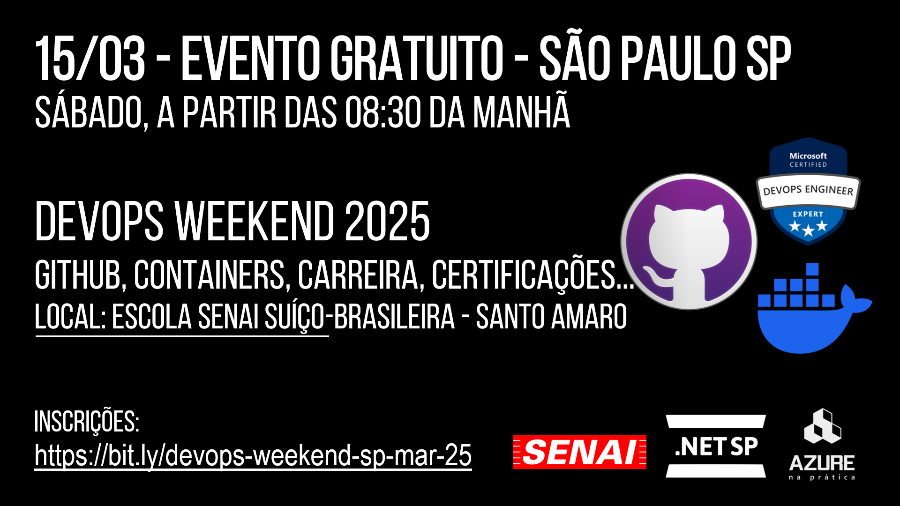
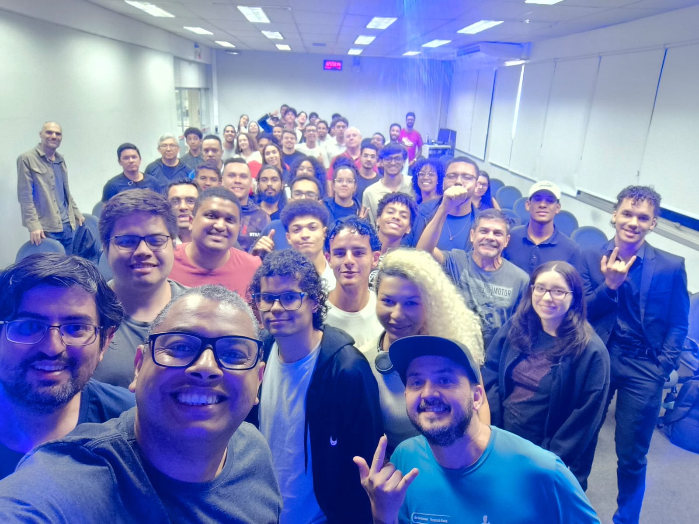
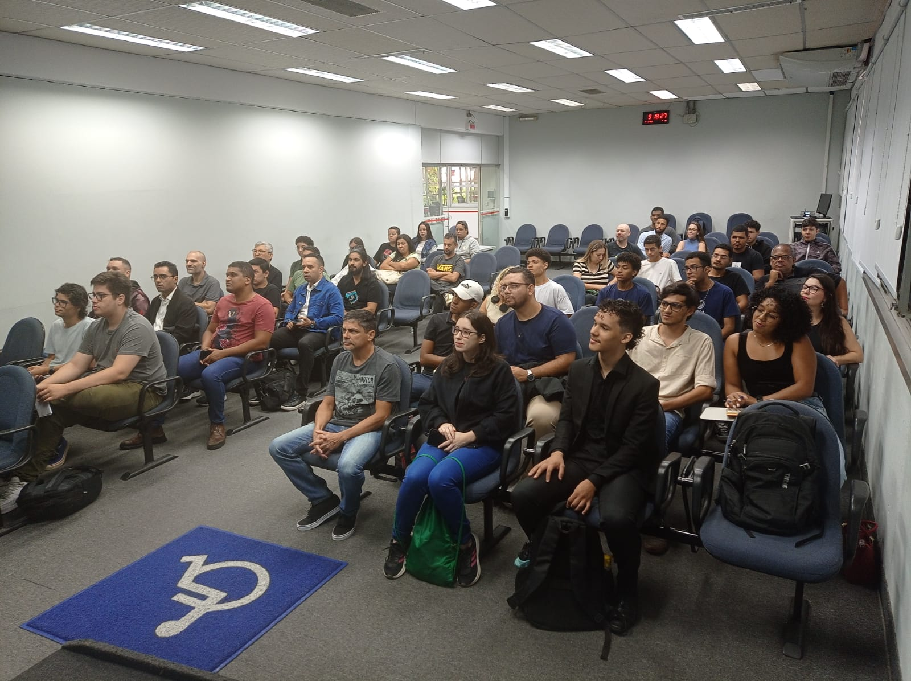
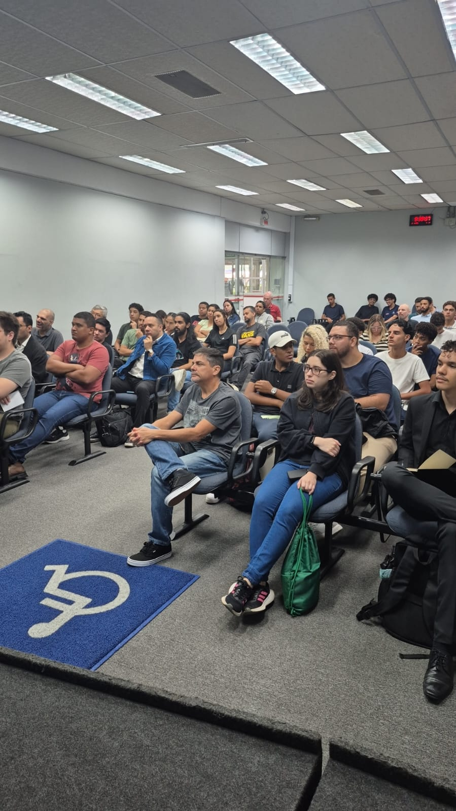
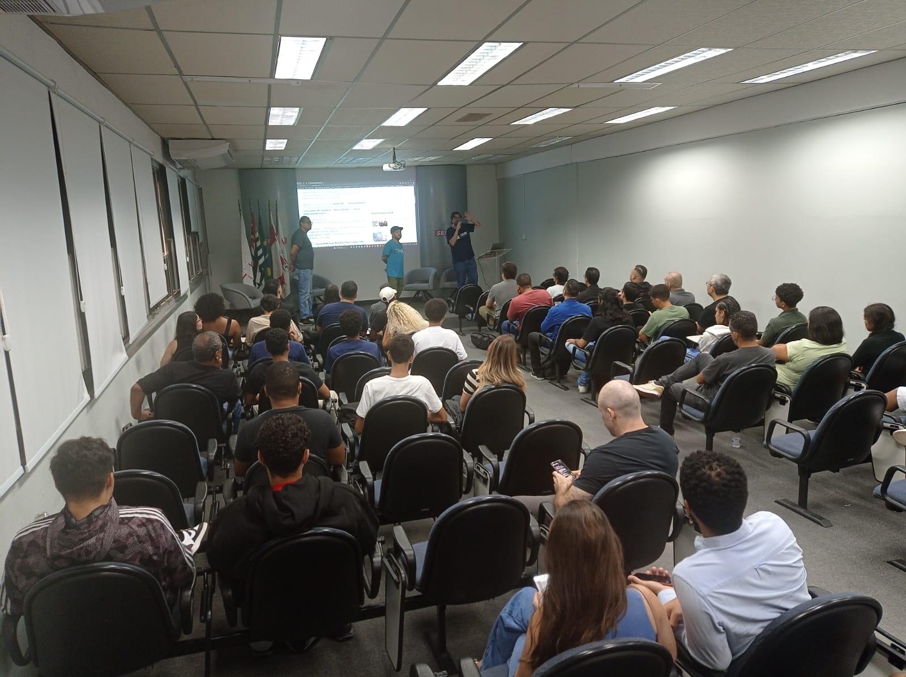
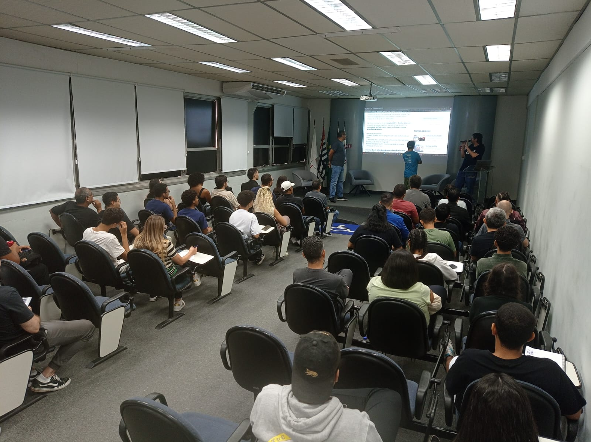
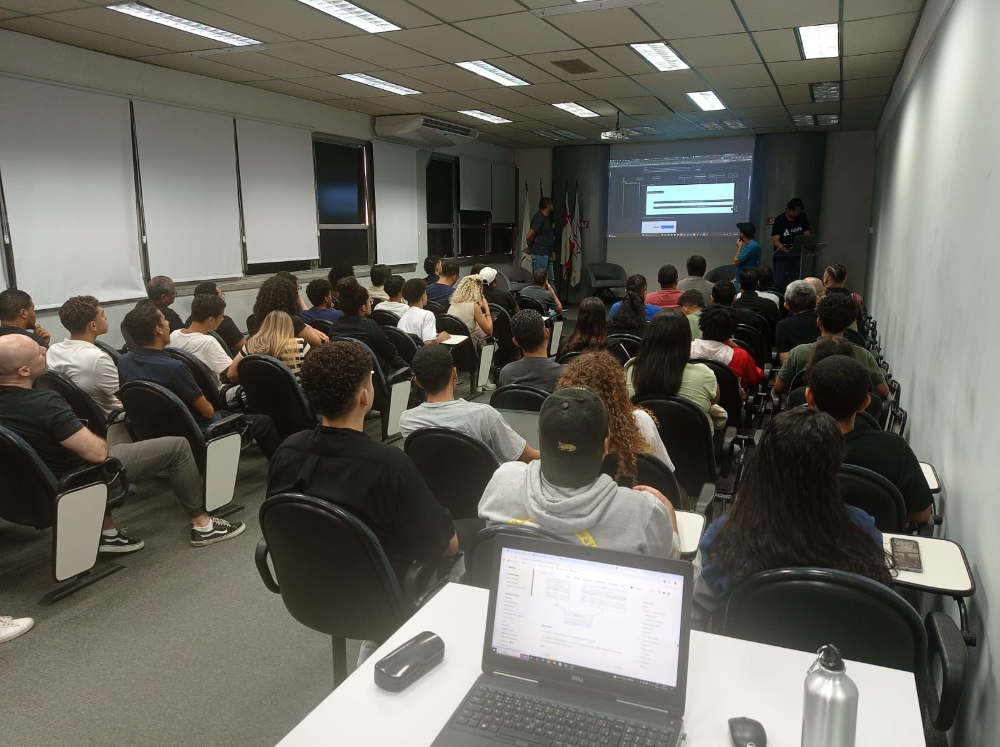
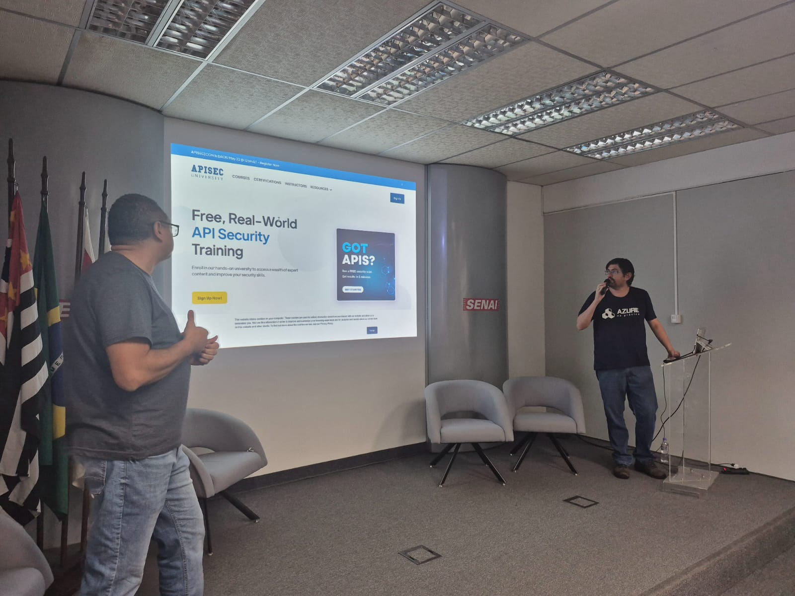
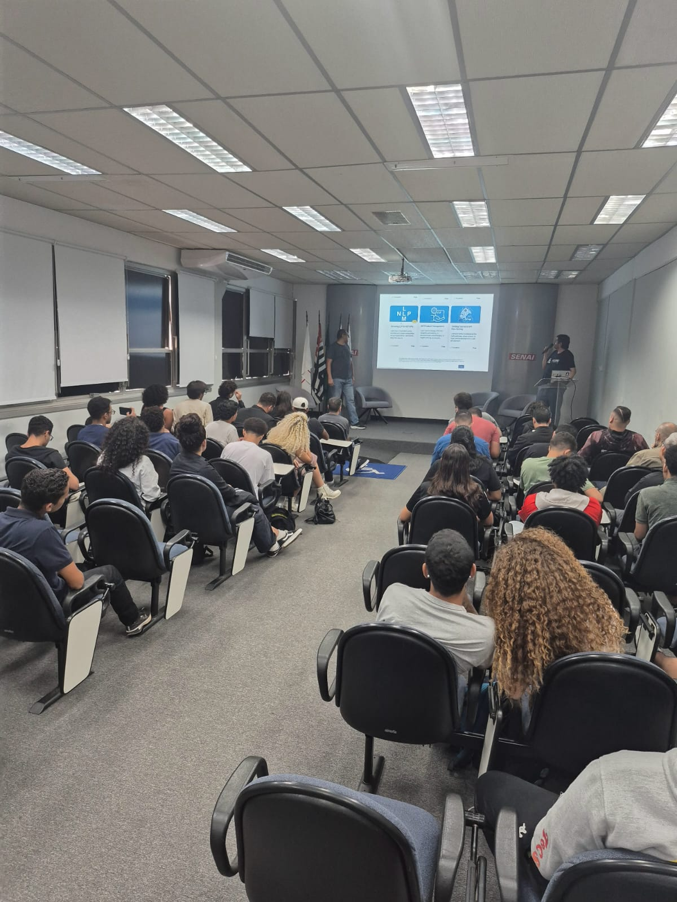
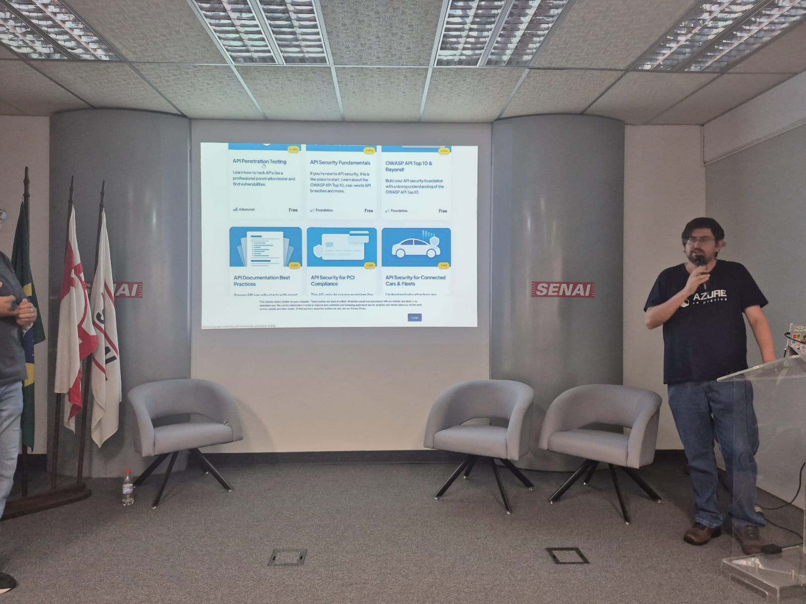

# DevOpsWeekend-2025-03
Fotos e informações gerais sobre o evento "DevOps Weekend", realizado em 15/03/2025 na cidade de São Paulo-SP.

Organizadores:
- **Renato Groffe (Microsoft MVP, Docker Captain, MTAC)**
- **Milton Camara Gomes (Microsoft MVP, MTAC)**
- **Atila Olivi (SENAI)**

Número de participantes: **65 pessoas**

Apresentações/talks que aconteceram durante o evento:
* **GitHub e GitHub Actions: pergunte tudo o que você sempre quis saber! - Renato Groffe (Microsoft MVP, Docker Captain, MTAC) e Milton Camara Gomes (Microsoft MVP, MTAC)**

* **Testcontainers + GitHub Actions: turbinando e descomplicando a automação de Testes de Integração - Renato Groffe (Microsoft MVP, Docker Captain, MTAC) e Milton Camara Gomes (Microsoft MVP, MTAC)**

* **Painel: DevOps e Nuvem - importâncias, dicas de carreira, certificações e muito mais! - Renato Groffe (Microsoft MVP, Docker Captain, MTAC), Milton Camara Gomes (Microsoft MVP, MTAC) e Rodrigo Jordão (Senior DevOps Analyst)**

Tecnologias e tópicos abordados: **GitHub, GitHub Actions, Git, Testes, DevOps, CI/CD, SRE, Azure Certifications, Linux and Cloud Native Certifications, APIsec Certifications, Docker, Testcontainers, Docker Hub, .NET, ASP.NET Core, C#, Linux, Kubernetes, Terraform, Cybersecurity, API Security, Java, Node.js, Python, Go...**

Acesse este [**link**](/img/) para visualizar todas as fotos das apresentações.

Este evento foi uma parceria entre a comunidade [**.NET SP**](https://www.meetup.com/dotnet-Sao-Paulo/) e a [**Escola Senai Suíço-Brasileira Paulo Ernesto Tolle**](https://suicobrasileira.sp.senai.br/).

Formulário utilizado para inscrições: [**Sympla**](https://www.sympla.com.br/evento/devops-weekend-github-containers-certificacoes-gratuito-e-presencial-sao-paulo-sp/2834466)

Local: Escola SENAI Suíço-Brasileira Paulo Ernesto Tolle - Rua Bento Branco de Andrade Filho, 379 - Santo Amaro - São Paulo/SP - CEP 04757-000

---

